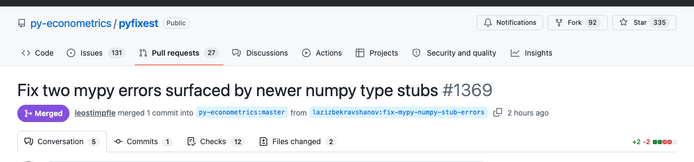
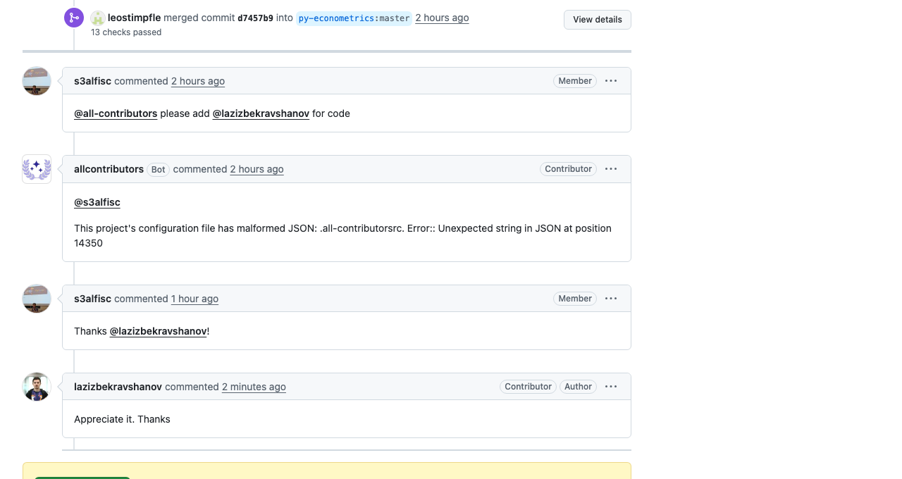

# Contribution README

**Name:** Lazizbek Ravshanov
**Program:** CodePath AI301, Summer 2026
**Status:** Cycle 1 complete — PR #603 **merged** into marimo-team/marimo-lsp (2026-06-24) · Cycle 2 complete — main fix [PR #1368](https://github.com/py-econometrics/pyfixest/pull/1368) **merged** (2026-07-04) and bonus [PR #1369](https://github.com/py-econometrics/pyfixest/pull/1369) **merged** (2026-07-02) into py-econometrics/pyfixest · Cycle 3 in progress — [pyfixest #829](https://github.com/py-econometrics/pyfixest/issues/829) (numba no-jit coverage): Phase III build complete on branch, push/PR held for maintainer approval (2026-07-08)

## Contributions at a Glance

| # | Issue | Project | Contribution | Status |
|---|---|---|---|---|
| 1 | [#154 — Extension runs cells marked as disabled](https://github.com/marimo-team/marimo-lsp/issues/154) | [marimo-team/marimo-lsp](https://github.com/marimo-team/marimo-lsp) (TypeScript / Python) | [PR #603](https://github.com/marimo-team/marimo-lsp/pull/603) — skip disabled cells in the execute-cells request | ✅ **Merged** 2026-06-24 (closed #154) |
| 2 | [#1244 — did2s estimator: `ValueError` when first-stage fixed effects can't be estimated](https://github.com/py-econometrics/pyfixest/issues/1244) | [py-econometrics/pyfixest](https://github.com/py-econometrics/pyfixest) (Python) | [PR #1368](https://github.com/py-econometrics/pyfixest/pull/1368) — early, informative error naming unestimable fixed-effect levels + regression test | ✅ **Merged** 2026-07-04 (merge commit `83fdcc5`, by @leostimpfle, after his predict-level refactor; closes #1244) |
| 2b | CI-blocking mypy errors (found while triaging PR #1368's checks) | [py-econometrics/pyfixest](https://github.com/py-econometrics/pyfixest) (Python) | [PR #1369](https://github.com/py-econometrics/pyfixest/pull/1369) — fix two type errors surfaced by newer numpy stubs | ✅ **Merged** 2026-07-02 (approved by @leostimpfle; @s3alfisc added me to all-contributors) |
| 3 | [#829 — Add tests with `JIT=False` for numba coverage](https://github.com/py-econometrics/pyfixest/issues/829) | [py-econometrics/pyfixest](https://github.com/py-econometrics/pyfixest) (Python) | Run numba-heavy tests with `NUMBA_DISABLE_JIT=1` in the weekly extended CI so codecov captures numba code paths (JAX half of the issue is now obsolete) | 🔄 **In progress** — Phase I, selected from the CodePath list 2026-07-08 |

Cycle 1 (#154) is documented in full below, unchanged; Cycle 2 (#1244) documentation starts at [Cycle 2](#cycle-2); Cycle 3 (#829) starts at [Cycle 3](#cycle-3).

---

## Project

**Project:** [marimo-team/marimo-lsp](https://github.com/marimo-team/marimo-lsp)
**My fork:** https://github.com/lazizbekravshanov/marimo-lsp

marimo-lsp is the language server and official VS Code extension for marimo, an open-source reactive Python notebook. It bridges three runtimes — the VS Code notebook UI, a Python LSP server, and the marimo kernel — so marimo notebooks run natively inside VS Code.

---

## Phase I: Issue Selection

### Issue

[marimo-team/marimo-lsp #154: Extension runs cells marked as disabled](https://github.com/marimo-team/marimo-lsp/issues/154)

Labels: `bug`, `good first issue`

### Why I Chose This Issue

Cells marked `@app.cell(disabled=True)` execute anyway when run from the VS Code extension, while marimo's own frontend respects the flag. The core maintainer confirmed disabled cells "aren't currently supported" in the extension, called the fix achievable, added it to the roadmap, and explicitly wrote "we'd welcome a contribution." I verified before claiming it: no assignee, no linked pull requests, and the repository is exceptionally responsive — PRs were merged the same day I checked, and maintainers replied to recent issues within minutes to a few hours.

### Definition of Done

A clear, testable bar for "fixed," set before writing any code:

- The extension **excludes** cells marked `@app.cell(disabled=True)` from execution, matching the behavior of marimo's own frontend.
- A **regression test** fails on the current code and passes with the fix.
- The **full `just test-ts` suite stays green** (no regressions) and `just lint` is clean.
- A **manual F5 end-to-end check** shows the disabled cell produces no output while enabled cells run.
- A **pull request linked to #154** is opened, reviewed, and (target) merged.

### How This Contribution Aligns With My Goals

My objectives for this practicum are threefold, and I selected #154 specifically to exercise all three:

1. **Maintainer communication.** Practicing clear, technical written collaboration with project owners: a concise claim comment, a root-cause-first pull request description, and explicitly surfacing an open design decision (enforcement at the extension layer vs. the LSP server layer) for maintainer input rather than resolving it unilaterally.
2. **Technical depth.** Strengthening my ability to read and reason about an unfamiliar, multi-runtime system — tracing a user-visible defect across the VS Code notebook protocol, a `pygls`-based LSP server, and the marimo kernel — and validating behavior by executing the relevant code paths rather than inferring them.
3. **End-to-end open-source workflow.** Completing a contribution in full: issue selection and claiming, reproduction backed by a regression test, atomic commits under the project's conventions, and iteration on review feedback.

I deliberately chose a dual-stack (Python + TypeScript) issue over a single-file change so the work would stretch all three objectives while remaining scoped to the program's timeframe.

### Issue Selection Checklist Notes

I ran this issue through the Phase I selection checklist. My notes:

1. **I understand the problem.** In one sentence: running a cell marked `@app.cell(disabled=True)` from the VS Code extension executes it, when it should be skipped. "Fixed" looks like: the extension respects the disabled cell config the same way marimo's own frontend does, with a regression test (`just test`) covering it.
2. **Scope fits 3 to 4 weeks.** The change is contained to the cell-run path between the extension's `KernelManager` and the LSP server's command handler, which `ARCHITECTURE.md` documents in detail. No marimo core changes are required.
3. **Matches my skills.** Python (the LSP server) and TypeScript (the extension), with an unusually thorough `ARCHITECTURE.md` mapping the exact message flow I need to trace.
4. **Active and claimable.** No assignee, no linked PR, no competing claim comments. I measured the repository before choosing: PRs merged daily and maintainers replied to the last ten issues within minutes to a few hours.
5. **Helpful context.** The core maintainer triaged the issue and put it on the roadmap; `ARCHITECTURE.md` documents the three LSP channels between extension, server, and kernel; marimo's own docs specify the intended disabled-cell behavior to match.
6. **Clear setup documentation.** `CONTRIBUTING.md` gives a quick start (open in VS Code, press F5), the exact tooling (`uv`, `pnpm`, `just`), a pinned `.marimo-version` for the side-by-side marimo checkout, and `just lint` / `just test` commands. marimo also runs an active Discord community for contributor questions.

All six checks passed.

### Other Issues I Evaluated

#154 was not my first candidate. Before settling on it, I screened issues in other repositories and rejected them — which taught me a Phase I lesson I now apply first: **check assignees and linked PRs before investing in repo analysis.**

| Candidate | Why I passed on it |
|---|---|
| apache/burr #138 | Already effectively claimed / had an open PR |
| Several pytorch/ao issues | Claimed or already had open PRs |
| Several Daft issues | Claimed or already had open PRs |

By contrast, marimo-lsp #154 had no assignee, no linked PR, and no competing claim comments, plus a maintainer who had explicitly welcomed a contribution. I also catalogued **backup issues within marimo-lsp itself** (#581, #351, #491, #531; #591 parked as harder) in [`bug-archive.md`](./bug-archive.md), code-verified locally, so a second contribution is ready to start without re-doing discovery.

### Risks I Noted

The repository moves fast (multiple merges per day), so the code around my fix may shift while I work; I will rebase frequently and open a draft PR early. The maintainers may also prefer the fix at the extension (TypeScript) layer or the LSP server (Python) layer, so I asked in my claim comment to surface that preference before I write code.

---

## Phase II: Reproduce and Plan

### Understanding the Issue

**Problem.** A marimo cell authored as `@app.cell(disabled=True)` must not execute, but the VS Code extension runs it normally. marimo's own frontend respects the flag; the extension ignores it.

**Root cause (confirmed by reading and running the code).** Every execution request in the extension is assembled by `extension/src/lib/extractExecuteCodeRequest.ts`. Its loop skips only cells without a stable id, then pushes every remaining cell's code and id into the `execute-cells` request — it never checks the disabled config. This one function feeds **both** execution paths: `extension/src/kernel/NotebookControllerFactory.ts` (line 74) and `extension/src/kernel/SandboxController.ts` (line 55).

**Where `disabled` lives (verified by execution, not guesswork).** I ran the LSP server's own deserialize path (`MarimoConvert.from_py(...).to_ir()` → `dataclasses.asdict`) on a notebook containing a disabled cell. The cell arrives as `options: {"disabled": true}`, and `NotebookSerializer.ts` copies `cell.options` verbatim into the VS Code cell's `metadata.options`. So at the point of the bug the flag is readable as `metadata.options.disabled === true` — `CellMetadata.ts` already models `options` as `Record<string, unknown>`, so no schema change is required.

**Expected behavior:** disabled cells are excluded from the execution request. **Current behavior:** they are included and run.

### Reproduction Process

#### Environment Setup

OS: macOS (Darwin 25.5.0, Apple Silicon). Tools: node v25.6.1, git 2.50.1, uv 0.11.20, pnpm 11.5.3, just 1.52.0 (the last three installed via `brew install uv pnpm just`).

```sh
cd ~/pet
git clone https://github.com/lazizbekravshanov/marimo-lsp.git
cd marimo-lsp
git remote add upstream https://github.com/marimo-team/marimo-lsp.git
git fetch upstream && git checkout main && git merge --ff-only upstream/main
uv sync                      # Python deps (~5s)
pnpm -C extension install    # TS deps (~10s)
just test-ts                 # FAILED at first — see below
```

Two real issues hit and fixed (total setup ~15 minutes):

1. First `just test-ts` run failed: 8 of 40 test files errored with `Cannot find package '@marimo-team/smart-cells'`. Cause: `extension/package.json` links `@marimo-team/smart-cells`, `frontend`, and `openapi` from a side-by-side `marimo` checkout (`link:../../marimo/...`), so the unit tests **do** require the sibling clone described in CONTRIBUTING.md. Fix: `git clone --branch 0.23.9 --depth 1 https://github.com/marimo-team/marimo.git` next to `marimo-lsp` (0.23.9 = the pin in `.marimo-version`), then re-run `pnpm -C extension install`.
2. Second run still failed: `Tsconfig not found` for smart-cells (its tsconfig extends the workspace package `@marimo-team/tsconfig`) and `Cannot find package 'html-react-parser'` from `marimo/frontend`. Cause: the marimo workspace's own dependencies were not installed. Fix: `pnpm install` at the marimo repo root (~2m17s).

Baseline after fixes: `just test-ts` → **Test Files 40 passed (40); Tests 429 passed | 1 skipped (430)**.

#### Steps to Reproduce

**A. Unit-level reproduction (deterministic, the core evidence).** I wrote `extension/src/lib/__tests__/extractExecuteCodeRequest.test.ts` (mirroring the style of `getCellExecutableCode.test.ts`): it builds two mock cells — one normal, one with `metadata.options = { disabled: true }` — and asserts the returned `cellIds` exclude the disabled cell.

1. `cd ~/pet/marimo-lsp && git checkout fix-issue-154-disabled-cells`
2. `just test-ts src/lib/__tests__/extractExecuteCodeRequest.test.ts`
3. Expected: 3/3 tests pass. Actual: the issue-154 case fails — run twice, identical failure both times:

```
AssertionError: expected [ 'cell-enabled', 'cell-disabled' ] to not include 'cell-disabled'
Tests  1 failed | 2 passed (3)
```

The two passing sanity cases (enabled cells included; id-less cells skipped) isolate the failure to exactly the missing disabled check.

> These steps capture the **Phase II state**, when the branch held only the failing test. The branch now carries the squashed fix (`f63bc4e`), so a fresh checkout shows all tests **passing** — to re-observe the failure on current code, revert the four-line `isDisabled` skip (see *Reproduction Evidence* below).

**B. Manual end-to-end reproduction (user-facing).**

1. `cd ~/pet/marimo-lsp && code .`
2. Press **F5** ("Run Extension") to launch the Extension Development Host.
3. In the dev host, create a marimo notebook `repro154_mo.py` with two cells: `x = 1`, and a cell whose decorator is `@app.cell(disabled=True)` containing `print("RAN — bug if you see this")`.
4. Open it as a marimo notebook, pick a Python environment, and **Run All**.
5. Expected: the disabled cell is skipped (no output). Actual: it prints `RAN — bug if you see this`.

*Observed result (2026-06-22, with the fix applied):* the disabled cell produces **no output** while the `x = 1` cell runs normally — matching marimo's own frontend. Verified in the Extension Development Host via F5.

#### Reproduction Evidence

- **Deterministic unit reproduction (primary evidence).** `extension/src/lib/__tests__/extractExecuteCodeRequest.test.ts` fails on the unfixed code with `expected [...'cell-disabled'] to not include 'cell-disabled'`. In Phase II this lived as a standalone failing commit (`21986be`); following atomic-commit discipline it was later rebased and squashed into the final fix commit ([`f63bc4e`](https://github.com/lazizbekravshanov/marimo-lsp/tree/fix-issue-154-disabled-cells)), where the test now passes. To re-observe the failure on current code, revert the four-line `isDisabled` skip in `extractExecuteCodeRequest.ts` and re-run the test.
- **Manual end-to-end:** the F5 repro above — observed result pending (the one user-only GUI step still outstanding).
- The same test doubles as the **regression guard** that keeps #154 from recurring.

### Solution Approach

#### Analysis

The disabled config survives the whole pipeline (marimo file → LSP deserialize → `NotebookSerializer` → cell `metadata.options`) and is simply never consulted at the single choke point where execution requests are built. Fixing that one function fixes both execution paths at once.

#### Proposed Solution

Skip disabled cells inside `extractExecuteCodeRequest`'s loop, exposed through a typed getter on `MarimoNotebookCell` so the read is centralized and matches the existing `isStale` pattern.

#### Implementation Plan (UMPIRE)

**Understand:** disabled cells must not be sent to `execute-cells`; today `extractExecuteCodeRequest` includes them because its loop only checks for a missing stable id.

**Match:** `MarimoNotebookCell` already derives flags from metadata the same way (`isStale` reads `metadata.state`; `id` reads `metadata.stableId`), and the loop already uses the skip idiom (`if (Option.isNone(cell.id)) continue;`). The regression test mirrors the established vitest pattern in `extension/src/lib/__tests__/`.

**Plan:**
1. `extension/src/schemas/MarimoNotebookDocument.ts` — add an `isDisabled` getter on `MarimoNotebookCell` reading `metadata.options?.disabled === true` (defaults to false). No schema change needed.
2. `extension/src/lib/extractExecuteCodeRequest.ts` — add `if (cell.isDisabled) continue;` to the loop. This fixes both call sites (`NotebookControllerFactory.ts:74`, `SandboxController.ts:55`) in one place. Alternative — filtering at each call site — rejected: it duplicates logic and any future call site would silently re-introduce the bug.
3. Include the one-line fix for a latent bug that becomes load-bearing after filtering: the `if (codes.length === 0)` branch calls `Option.none()` without `return`, falling through to `Option.some({codes: [], cellIds: []})`. Once disabled cells are filtered, a selection of only disabled cells reaches this branch, so it must actually return `Option.none()` (the controller already handles that case by logging "Empty execution request" and stopping). This will be called out explicitly in the PR description.
4. Files touched: `extractExecuteCodeRequest.ts`, `MarimoNotebookDocument.ts`, plus the already-committed test file.
5. Open question posted on #154 (no maintainer reply yet): enforce at the extension layer or the LSP server layer. Recommendation: extension layer — it is where the request is assembled, and the maintainer framed this as a missing extension feature. If the maintainer prefers the server layer, the regression test still stands and the plan adapts.

**Implement:** branch https://github.com/lazizbekravshanov/marimo-lsp/tree/fix-issue-154-disabled-cells (test-only at plan time; the fix landed in Phase III — see Implementation Notes).

**Review:** run `just fix` and `just lint` before committing; install hooks with `uvx pre-commit install`; clear commit message; PR description links #154; per the repo's stated philosophy, no lint/type opt-outs.

**Evaluate:** the regression test flips to green with the fix; full `just test-ts` stays green (baseline: 40 files, 429 passed / 1 skipped); the manual F5 repro shows the disabled cell skipped. Integration suite (`just test-vscode`): run once before opening the PR as a sanity check, but no new integration test — the bug and fix are fully exercised at the unit seam where the request is constructed.

### Phase II Outcome

Phase II met three success criteria before any production code was written:

1. **Reproduced** — a deterministic unit test fails on the unfixed code (manual F5 confirmation pending).
2. **Root cause identified with evidence** — narrowed to a single function, with the `options.disabled` wire format *proven* by running the LSP deserialize path rather than inferred from the schema.
3. **Concrete, reviewable plan** — the UMPIRE plan above, with explicit acceptance criteria, the one-place fix justified over per-call-site filtering, and the open extension-vs-server question surfaced to the maintainer.

---

## Phase III: Build

### Progress Log

- **Jun 10 (Phase II):** reproduced the bug with a failing regression test; drafted the UMPIRE plan; claimed the issue.
- **Jun 17:** rebased the branch onto upstream `v0.13.5` (confirmed `.marimo-version` and both target files unchanged first); implemented the `isDisabled` getter, the skip, and the empty-request `return` fix; full unit suite green (462 passed / 1 skipped) and `just lint` clean; ran `just test-vscode` (passed); squashed to one atomic Conventional-Commits commit; opened draft PR #603.
- **Jun 18:** hardened the journal against the rubric (Definition of Done, evaluated-issues comparison, self-review checklist, this log) and added a Conventional-Commits `commit-msg` hook to the journal repo.

### Testing Strategy

The strategy was defined in Phase II (a regression test written first, failing by design) and executed in Phase III. CONTRIBUTING.md requires lint + tests to pass (enforced by pre-commit hooks via `uvx pre-commit install`); there is no PR template, and the repo's merged-PR style is a plain descriptive title with `(#NNN)`.

**Unit tests** (`extension/src/lib/__tests__/extractExecuteCodeRequest.test.ts`, vitest — modeled on the sibling `getCellExecutableCode.test.ts`):
- Test 1: enabled cells with stable ids are included in the execution request (sanity) — **pass**.
- Test 2: cells without a stable id are skipped (sanity) — **pass**.
- Test 3 (regression for #154): a cell with `metadata.options = { disabled: true }` is excluded from `codes` and `cellIds` — **failed before the fix** (`expected [...'cell-disabled'] to not include 'cell-disabled'`), **passes after**.
- Test 4 (edge case, added with the fix): a selection containing only disabled cells returns `Option.none()` — exercises the corrected empty-request branch. Confirmed it genuinely fails when only the `return` is reverted, then passes with the fix in place.

**Validation performed (all local, results captured in Implementation Notes):** target file → **4 passed**; full `just test-ts` → **44 files, 462 passed / 1 skipped** (zero regressions); `just lint` (ruff + `ty` + TS check) → **clean**.

**Integration sanity check:** `just test-vscode` (the slow VS Code integration suite) was run as a pre-PR sanity check and **passed** (exit 0; the only console noise was VS Code's benign listener-leak teardown diagnostics). No new integration test was added — the bug is fully exercised at the unit seam where the request is constructed.

**Still owed (user-only, not blocking Phase III):** the F5 end-to-end manual repro re-run (disabled cell shows no output while the enabled cell runs) — a GUI step.

### Implementation Notes

The fix landed on `fix-issue-154-disabled-cells` (a single atomic commit `f63bc4e`, rebased onto upstream `v0.13.5`), exactly as the Phase II plan specified. Three files changed — two source files (changes below) plus the regression test:

1. **`extension/src/schemas/MarimoNotebookDocument.ts`** — added an `isDisabled` getter on `MarimoNotebookCell` that reads `metadata.options?.disabled === true` (defaults to `false`), mirroring the existing `isStale` getter's `Option.map(...).getOrElse(() => false)` shape. No schema change — `CellMetadata` already models `options` as `Record<string, unknown>`.
2. **`extension/src/lib/extractExecuteCodeRequest.ts`** — added `if (cell.isDisabled) continue;` to the build loop. This single choke point feeds both execution paths (`NotebookControllerFactory.ts`, `SandboxController.ts`), so both are fixed at once.
3. Same file — corrected the latent empty-request bug: the `if (codes.length === 0)` branch called `Option.none()` **without returning**, falling through to `Option.some({codes: [], cellIds: []})`. Once disabled cells are filtered, a selection of only-disabled cells reaches this branch, so it now actually `return`s `Option.none()` (the controller already handles that by logging "Empty execution request" and stopping).

**TDD discipline followed.** The pre-existing regression test was re-run and watched fail on current upstream code (`expected [...'cell-disabled'] to not include 'cell-disabled'`) before the fix. After the fix it flips green. I added a second case — *only-disabled selection returns `Option.none()`* — and verified it genuinely fails (by temporarily reverting just the `return`) before keeping it, so the corrected empty-request branch is actually covered rather than assumed.

**Verification (all run locally, evidence captured):**
- `just test-ts src/lib/__tests__/extractExecuteCodeRequest.test.ts` → **4 passed** (2 sanity, regression, empty-request).
- `just test-ts` (full suite) → **44 files, 462 passed | 1 skipped** (upstream grew the suite from the v0.13.4 baseline of 40/429; zero regressions).
- `just lint` → ruff, `ty`, and the TS check (format + types + CSS variables) all clean after `just fix` normalized formatting.

**Status:** draft PR [#603](https://github.com/marimo-team/marimo-lsp/pull/603) opened (Phase IV). Remaining: the manual F5 end-to-end repro re-run (disabled cell shows no output — a user-only GUI step), and the maintainer's answer on the preferred layer (extension vs. server), which the draft PR explicitly asks for.

### Code Changes

**Branch:** [`fix-issue-154-disabled-cells`](https://github.com/lazizbekravshanov/marimo-lsp/tree/fix-issue-154-disabled-cells) (on my fork), rebased onto upstream `v0.13.5`.

**One atomic commit** (`f63bc4e`):

> `fix(extension): skip cells marked disabled when building the execute-cells request`

**Diff scope (3 files, ~40 lines):** `extension/src/schemas/MarimoNotebookDocument.ts` (+`isDisabled` getter), `extension/src/lib/extractExecuteCodeRequest.ts` (skip + `return` fix), `extension/src/lib/__tests__/extractExecuteCodeRequest.test.ts` (+2 tests). No unrelated changes, no debug code, formatting normalized by `just fix`.

**Why one commit, not two (atomic-commit discipline).** I initially split this as *test (red)* → *fix (green)* to mirror the TDD process. But an atomic commit must leave the tree in a **working state** so it can be applied or reverted independently — and a standalone failing-test commit leaves the build red, which breaks that property. So the two were squashed into a single commit that carries the test **and** the fix together: the tree is green at every point in history, and the change is revertible as one unit. The red→green TDD story still lives where it belongs — in these notes and the PR description — rather than in committed history. The message follows [Conventional Commits](https://www.conventionalcommits.org/) (`fix` type, `extension` scope, `Closes #154` footer).

> Note on the PR title vs. the commit: marimo-lsp **squash-merges** with a plain descriptive title (no PR template, and merged history shows titles like *"Linkify file paths in cell tracebacks (#572)"*), so the PR is titled *"Skip cells marked disabled when building the execute-cells request (#154)"* to match the project's actual convention — while the branch commit uses Conventional Commits as a good local-history practice. Matching the project's real convention for what merges is itself part of the lesson.

### Challenges Faced

- **The fix surfaced a second, latent bug.** Filtering disabled cells made the long-dormant empty-request branch reachable: `if (codes.length === 0) { Option.none() }` never `return`ed, so a selection of only-disabled cells would have fallen through to an empty `execute-cells` request instead of stopping. Caught it by reasoning about the new control flow, then proved it with a dedicated test (reverting just the `return` to watch it fail) rather than assuming.
- **Keeping current with a fast-moving repo.** Upstream advanced from `v0.13.4` to `v0.13.5` (and the test suite grew 40→44 files) between Phase II and Phase III. Before re-verifying, I checked that `.marimo-version` (still `0.23.9`, so the sibling checkout stays valid) and both target files were untouched upstream, then rebased cleanly — avoiding a stale baseline.
- **AI usage stayed reviewer-defensible.** I can explain every line without referencing tool output: the getter mirrors the existing `isStale` pattern, and the `metadata.options.disabled` read was verified against the LSP's own deserialize wire format in Phase II, not guessed.

### Self-Review Checklist (pre-submission)

Ran the Phase III pre-submission checklist before marking the phase complete:

- [x] **Code change works** — disabled cells are excluded from the execution request, verified by the regression test (manual F5 confirmation pending).
- [x] **Tests pass** — new tests green; full `just test-ts` 462 passed / 1 skipped; `just test-vscode` integration suite green.
- [x] **Style compliance** — `just lint` (ruff + `ty` + TS format/type/CSS checks) clean; repo pre-commit hooks installed.
- [x] **No unnecessary changes** — diff is 3 files / ~40 lines scoped to #154; no debug code, no unrelated formatting.
- [x] **Commit history clean** — one atomic, Conventional-Commits commit, with the tree green at that commit.
- [x] **README updated** — implementation summary, branch link, and testing notes all present.
- [x] **Manual F5 end-to-end** — verified (2026-06-22): the disabled cell produces no output while the enabled cell runs.

---

## Phase IV: Submit and Iterate

*PR opened early as a draft, marked ready for review once all checks were green, and **merged by the maintainer on 2026-06-24** (squash commit [`619188e`](https://github.com/marimo-team/marimo-lsp/commit/619188e937a0)).*

### Pull Request

**PR:** [marimo-team/marimo-lsp#603 — Skip cells marked disabled when building the execute-cells request (#154)](https://github.com/marimo-team/marimo-lsp/pull/603) — **merged** 2026-06-24 (approved by @manzt; closed #154).

Before marking it ready I ran a senior-reviewer pre-submission audit: walked the full diff (3 files, scoped to #154, no debris), rebased onto current `upstream/main` (clean — resolved a post-rebase oxlint dependency-staleness error that was environmental, not in the diff), re-verified all suites, and **corrected a maintainer misattribution** (the triage was by **@manzt**, the sole `CODEOWNER`, not @mscolnick). The PR title is a plain descriptive sentence with `(#154)`, matching the repo's squash-merge convention (it has no PR template). The full description (why → root cause → what → evidence → the open extension-vs-server layer question) is archived in [`PR_DESCRIPTION.md`](./PR_DESCRIPTION.md).

### Summary

A three-file, ~40-line fix at the single choke point where the extension assembles its `execute-cells` request, plus a regression test and an empty-request edge-case test. Verified green on the rebased branch: `just test-ts` 466 passed / 1 skipped, `just lint` clean, `just test-vscode` integration suite passing, and a manual F5 end-to-end check (disabled cell shows no output). The one open question raised in the PR is whether to enforce at the extension layer (where the fix sits) or the LSP server layer.

**Status:** Merged (2026-06-24) — approved by @manzt and squash-merged as `619188e`.

### Design Note — Why the Extension Layer (verified against the kernel)

The open question on the PR is whether to enforce `disabled` at the extension or the LSP-server/kernel layer. Rather than guess, I traced it through marimo's runtime:

- **Reactive execution is already safe kernel-side.** When an upstream cell runs, marimo's cell runner skips any scheduled descendant whose `config.disabled` is set — or that is transitively disabled through a disabled ancestor (`marimo/_runtime/runner/cell_runner.py`, `DirectedGraph.is_disabled`). So a disabled *downstream* cell is never re-run by the kernel, and the extension is not involved in that path.
- **The gap is the explicit run-request path.** The extension's "Run"/"Run All" assembles an `execute-cells` request that the server forwards verbatim as a control request (`src/marimo_lsp/api.py` `run` → `put_control_request`). That explicit request was honored as-is — which is exactly the reported bug (reproduced; confirmed via F5 that a manual Run executed the disabled cell before the fix).
- **Therefore the extension is the correct, minimal layer.** `extractExecuteCodeRequest` is where that explicit request is built, so excluding disabled cells there fixes #154 without touching the kernel's already-correct reactive behavior.

Conclusion: the fix is **complete** for #154 — there is no reactive path that re-runs a disabled cell, and the manual path is now filtered. This analysis is also my prepared answer if the maintainer asks why not the server layer: the kernel already guards reactive runs; only the explicit run-request path (which originates in the extension) needed the guard.

### Maintainer Feedback Log

- **2026-06-22** — PR #603 marked ready for review; requested review from @manzt (sole `CODEOWNER` and #154 triager) with a first-contribution comment surfacing the extension-vs-server layer question.
- **2026-06-24** — @manzt **approved and merged** (squash `619188e`). Review: *"I think this fix looks great."* He accepted the extension-layer approach (did not request the server layer), and noted the prior delay was jury duty. He suggested a **follow-up** — surface the disabled state in the UI and allow enabling/disabling cells — explicitly "can be a follow up." Logged as a future contribution candidate.

---

# Cycle 2

*Cycle 1 (#154 → PR #603) merged 2026-06-24; everything above documents it and stays as the record of that contribution. Cycle 2 starts Week 5 with a second contribution — this time to a different project, selected from the course's official issue list.*

## Cycle 2 — Project

**Project:** [py-econometrics/pyfixest](https://github.com/py-econometrics/pyfixest)
**My fork:** to be created at the start of Phase II

pyfixest is a Python library for fast fixed-effects regression and related econometric estimators (a Python counterpart to R's `fixest`), built on pandas/NumPy with a Rust demeaning backend. My issue lives in its difference-in-differences module (`pyfixest/did/did2s.py`).

## Cycle 2 — Phase I: Issue Selection

### Issue

[py-econometrics/pyfixest #1244: `event_study` did2s estimator gives `ValueError` when some fixed effects are not estimated in the first stage](https://github.com/py-econometrics/pyfixest/issues/1244)

Labels: `bug`

> Selection note: earlier picks this cycle were marimo-lsp #581 (2026-07-01) and marimo-lsp #491 (2026-07-02 morning), both from my Cycle 1 bench. The selection was redone the same day from the **course's official issue list** (`AI301 Issue Candidates.xlsx`, 24,774 rows, refreshed 6/26) with two hard criteria: the issue is genuinely unresolved and unclaimed, and the maintainer is *actively responding* on the issue/repo. I also wanted the Python stack this cycle. #1244 won; the full elimination trail is under "Other Issues I Evaluated".

### Why I Chose This Issue

pyfixest is a Python econometrics library (fixed-effects regressions à la R's `fixest`). In its two-stage difference-in-differences estimator (`did2s`), when the first-stage regression cannot estimate some fixed-effect levels (e.g., a collinear unit×time combination), the predicted values for those rows become `NaN`, the second-stage residual vector `_second_u` ends up **shorter** than the first-stage `_first_u`, and calling `vcov()` later explodes with an opaque `ValueError: operands could not be broadcast together with shapes` deep inside `_did2s_vcov`.

The reporter (@marcandre259) did outstanding groundwork: exact mechanism traced through `did2s.py`, a synthetic-repro recipe (drop a key from `fit1.fixef()` after the first stage), and a clear statement of expected behavior — collinearity *should* error, but **early and informatively**, not as a broadcast failure three calls later. Maintainer @s3alfisc confirmed the same day (2026-03-11): *"Indeed this looks like a bug to me. I'll try to take a look over the weekend =)"* — and hasn't gotten to it in the 3.5 months since. Verified 2026-07-02 via the GitHub API: still open, unassigned, zero linked PRs, zero competing claims.

The maintainer-responsiveness evidence is repo-wide, not just this thread: sampling pyfixest's issue tracker shows @s3alfisc replying to reporters and would-be contributors within 1–2 days, consistently and warmly (e.g., #961, #1177, #1244 itself).

### Definition of Done

- **Claim accepted**: since the maintainer said he'd look at it himself, the claim comment explicitly asks whether it's free to take before any code is written.
- A **regression test** reproduces the failure on current `master` (synthetic collinear data or the reporter's fixef-key-removal recipe) and fails before the fix.
- The fix makes the failure mode **explicit and early**: unestimated first-stage fixed-effect levels are detected right after the first stage and raise an informative error naming the offending levels (or handle them gracefully, if the maintainer prefers — asked in the claim comment).
- The project's **full test suite and lint pass** per its contributing guide.
- A **pull request linked to #1244** is opened, reviewed, and (target) merged.

### How This Contribution Aligns With My Goals

1. **Switching stacks deliberately.** Cycle 1 was TypeScript in a VS Code extension; this is pure Python in a scientific-computing library — different test culture (pytest + numerical assertions), different review norms, and my first contribution where correctness is *statistical*, not just behavioral.
2. **Working a new maintainer relationship from zero.** Cycle 1's reviewer knew my work by PR time. Here I start cold with a claim comment that must carry its own credibility: reproduce first, propose the fix shape, ask the design question up front.
3. **Contributing where the diagnosis isn't mine.** The reporter's analysis is the map; my job is to verify it independently, convert it into a failing test, and negotiate the error-vs-graceful-handling design with the maintainer — practicing building on someone else's investigation rather than my own.

### Issue Selection Checklist Notes

1. **I understand the problem.** In one sentence: when did2s's first stage can't estimate some fixed-effect levels, downstream arrays silently diverge in length and `vcov()` crashes with an unrelated-looking broadcast error. "Fixed" looks like: the problem is caught at the first stage with an error message that names the unestimable levels.
2. **Scope fits the time available.** The mechanism is already traced to specific lines (`did2s.py` ~217 first-stage predictions, ~372 `second_u *= weights_array`); the work is verification, a failing test, an early guard, and the design conversation.
3. **Matches my skills.** Python, pandas/NumPy arrays, pytest — my primary stack (Cycle 1 was the stretch; this is home ground plus new domain vocabulary).
4. **Active and claimable.** Verified 2026-07-02: open, unassigned, no linked PRs (timeline cross-references checked), no competing claim comments; maintainer active on the repo within the last two weeks.
5. **Helpful context.** Reporter provided mechanism, repro recipe, and diagnostic code; maintainer confirmed it's a real bug; the file is self-contained (`pyfixest/did/did2s.py`).
6. **Setup documented.** New environment (fork + clone + `uv`-managed Python deps per the contributing guide) — planned as the first Phase II step; unlike Cycle 1 there is no GUI dependency, so the whole repro is scriptable.

All six checks passed.

### Other Issues I Evaluated

Selection ran in three rounds on 2026-07-02, all availability claims verified live via the GitHub API (state, assignees, full comment threads, timeline cross-references).

**Round 1 — course spreadsheet triage.** Parsed `AI301 Issue Candidates.xlsx` (24,774 rows; found and corrected a one-row misalignment between the metadata columns and the URL column). Filtered to unclaimed issues in repos whose primary language is Python/TypeScript/JavaScript (7,687), then live-checked ~360 sampled issues across 40 repos. Most of the field fell to four failure modes: already claimed or PR'd (zulip, scikit-learn, stdlib, airflow — heavily farmed), maintainer replies years stale (cpython, galaxy, DSpace, element-web), no maintainer engagement at all (code-charity/youtube, aden-hive/hive), or untestable on my machine (nvaccess/nvda — Windows-only).

**Round 2 — finalists.** | Candidate | Why not |
|---|---|
| WeblateOrg/weblate #12167, #10341 (Python; the most responsive maintainer found, replies <1 day) | Both already requested by fellow AI301 students in June; every other viable Weblate good-first-issue also had a fresh claim or open PR. |
| refined-github #9722 (TypeScript; `small`+`help wanted`, maintainer replied Jun 13 with module pointer) | Strongest frontend option — passed on it because I wanted Python this cycle. |
| super-productivity #5950 (TypeScript; owner said "PRs are welcome") | Same reason; also the thread mixes two problems. |
| OpenSearch-Dashboards #10338 (TypeScript; maintainer diagnosed root cause) | Single maintainer comment ever (Sep 2025) — weakest responsiveness evidence. |
| pyfixest #961 (Python; docs) | Initially chosen, then dropped on a full-thread read: a contributor had already offered in May 2026 and was awaiting the maintainer's reply, and the remaining work is docs cross-linking — thin for a cycle. |

**Round 3 — inside pyfixest.** | Candidate | Why not |
|---|---|
| #1138 `fixef_tol` not passed to scipy/cupy | Maintainer-authored with exact pointer, but entangled with the open performance investigation #1042, and the cupy path needs a GPU. |
| #1177 `fixef()` on IV | Small feature, maintainer receptive — but #1244 is a confirmed bug with a repro recipe, a better shape for the phase structure. |
| #1123 deprecate renaming utils | Mechanical cleanup; weakest learning story. |

**Prior marimo-lsp bench** (#581, #491, #531, #351, #591 — analyses in [`bug-archive.md`](./bug-archive.md)): all verified still available on 2026-07-02 and remain Cycle 3 candidates, alongside @manzt's invited follow-up from PR #603.

### Risks I Noted

- **The maintainer said he'd look at it himself.** He may have local work-in-progress. Mitigation: the claim comment asks explicitly before I build anything.
- **No shareable dataset.** The reporter couldn't share data, so the regression test must construct synthetic collinear panel data (or use the fixef-key-removal recipe) — the repro is mine to build, and it must convincingly represent the real failure.
- **Design question is open.** Early informative error vs. graceful handling (drop unestimable levels and proceed) — the reporter is fine with an error; the maintainer hasn't said. Asked up front in the claim comment.
- **New project, new toolchain.** First contribution outside marimo-lsp: fork, environment, contributing conventions, and CI norms all need discovery — budgeted as the first Phase II task, with the Mon 2026-07-06 deadline in view.

### Phase I Outcome

[Claim comment posted 2026-07-02](https://github.com/py-econometrics/pyfixest/issues/1244#issuecomment-4867926223): asks whether the issue is free (the maintainer had said he'd look himself), states the intended approach (detect unestimable first-stage fixed-effect levels early, regression test on synthetic collinear data first), and poses the hard-error-vs-graceful-handling design question. Awaiting @s3alfisc's reply; Phase II (environment setup + reproduction) can start in parallel since the repro work is useful under either design answer.

## Cycle 2 — Phase II: Reproduce and Plan

### Environment Setup (2026-07-02)

- Forked `py-econometrics/pyfixest` → `lazizbekravshanov/pyfixest`; cloned to `~/pet/pyfixest` with the original repo as the `upstream` remote (fork `master` at upstream head `27dfbba`).
- Toolchain per the contributing guide: **pixi** manages everything (`brew install pixi`, then any `pixi run …` task auto-creates the conda environment, including the Rust toolchain and the maturin-built `src/` extension — no global Rust needed). Key tasks: `pixi run test-py` (quick suite), `pixi run lint` (prek hooks).
- First environment build + `import pyfixest` succeeded on the first attempt — a welcome contrast to Cycle 1's two setup failures.

### Reproduction (2026-07-02, upstream `master` @ `27dfbba`)

The reporter's recipe (delete a key from `fit1.fixef()`) simulates the failure; I found a **natural trigger that needs no code modification**: an *always-treated* unit. `_did2s_estimate` fits the first stage only on not-yet-treated rows (`did2s.py:205-207`), so a unit with no untreated periods never gets its fixed effect estimated; `fit1.predict(newdata=data)` returns `NaN` for all of that unit's rows (`did2s.py:231`), the NaNs flow into the second-stage dependent variable, `feols` silently drops those rows, and `_second_u` comes out shorter than the full-length arrays built from `data` in `_did2s_vcov`.

Synthetic panel (20 units × 10 years, unit 1 treated from period 1) crashes exactly as reported:

```
File "pyfixest/did/did2s.py", line 355, in _did2s_vcov
    second_u *= weights_array
ValueError: operands could not be broadcast together with shapes (190,) (200,) (190,)
```

190 vs 200 = the always-treated unit's 10 dropped rows. This confirms the reporter's mechanism end-to-end and shows the bug fires on completely ordinary DiD data (always-treated units are common), not just degenerate collinearity.

### Fix Plan (pending maintainer's design answer)

- **Guard location**: in `_did2s_estimate`, immediately after `Y_hat = fit1.predict(newdata=data)` (`did2s.py:231`) — check `np.isnan(Y_hat)`; if any, resolve *which* fixed-effect levels are missing by comparing `fit1.fixef()`'s levels per FE variable against the levels present in `data`, and raise an informative error naming them (e.g., "unit levels [1] have no not-yet-treated observations, so their fixed effects cannot be estimated in the first stage").
- **Test**: regression test in `tests/test_did.py` with the synthetic always-treated panel, `pytest.raises` asserting the new error message — fails on current master (where the broadcast `ValueError` escapes instead).
- **Alternative if the maintainer prefers graceful handling**: drop the affected rows with a warning before the second stage and keep all downstream arrays consistent — bigger change, touches `_did2s_vcov` array construction.

## Cycle 2 — Phase III: Build (2026-07-02)

Test-driven, on branch `fix-issue-1244-did2s-unestimated-fixef` (from upstream `27dfbba`):

1. **RED** — regression test `tests/test_errors.py::test_did2s_unestimated_first_stage_fixef`: a 6×5 synthetic panel with an always-treated unit, `pytest.raises(ValueError, match="could not be estimated in the first stage")`. Watched it fail for the right reason: the current code raises the opaque broadcast `ValueError` (`shapes (25,) (30,)`), so the regex doesn't match.
2. **GREEN** — guard in `_did2s_estimate` (`pyfixest/did/did2s.py`), immediately after `Y_hat = fit1.predict(newdata=data)`: if any prediction is `NaN`, diff each fixed-effect variable's levels in `data` against `fit1.fixef()`'s estimated levels and raise a `ValueError` naming the unestimable levels and explaining why (no not-yet-treated observations / collinearity) and what to do (drop the affected observations). Test passes; on the Phase II repro panel the message reads `… only: unit: ['1'] …`.
3. **Changelog** — entry under "PyFixest 0.70.0 (In Development) → Bug Fixes".

**Verification:** new test red→green; `pixi run test-py` 686 passed / 11 skipped (2 collection errors are a missing optional `torch` in the default env — pre-existing, also on `master`); `pixi run lint` passes all hooks except 2 pre-existing `mypy` errors in files this diff doesn't touch. One commit, tree green at the commit.

## Cycle 2 — Phase IV: Submit and Iterate

- **PR opened 2026-07-02**: [py-econometrics/pyfixest #1368](https://github.com/py-econometrics/pyfixest/pull/1368) — "Raise an informative error in did2s when first stage fixed effects cannot be estimated". Body: Why → root cause → what the PR does → design note (hard error per the reporter's preference, explicitly offering to rework to graceful handling if @s3alfisc prefers) → evidence → Closes #1244.
- The maintainer had not yet replied to my claim comment when the PR went up; the PR's design note keeps that conversation open rather than presuming the answer.
- **CI triage (2026-07-02)**: the main CI workflow awaits first-contributor approval (expected). pre-commit.ci shows red — investigated and traced to the **2 pre-existing `mypy` errors** (`separation.py:141`, `ritest.py:395`): the hook's `additional_dependencies: [numpy>=1.20, …]` floats to the newest numpy, whose stricter type stubs broke these repo-wide (PR #1366 fails identically; my diff doesn't touch either file). Documented in the PR body with an offer to fix it in a separate PR — kept out of this one to keep the diff atomic.
- **Follow-up delivered**: [PR #1369](https://github.com/py-econometrics/pyfixest/pull/1369) — "Fix two mypy errors surfaced by newer numpy type stubs" (opened 2026-07-02). Verified the errors exist on clean `master` first (baseline red), then: `separation.py` switched from `np.sum(DataFrame, axis=0).values` (runtime Series, typed as ndarray) to the pandas-native `.sum(axis=0).to_numpy()` — equivalence confirmed on 50 randomized crosstabs; `ritest.py` return annotation corrected to match the actual scalars-plus-array return. mypy hook red→green locally; `test_ritest.py` 54 passed, separation-path tests 66 passed. This unblocks pre-commit.ci for every open PR, including #1368.

### Maintainer Feedback Log

| Date | Who | Feedback | Action |
|---|---|---|---|
| 2026-07-02 | @leostimpfle | **Approved and merged the follow-up PR #1369** (mypy fixes) within hours of it opening | — |
| 2026-07-02 | @s3alfisc | Asked the all-contributors bot to **add me to the project's contributors list** ("please add @lazizbekravshanov for code") on #1369 | Rebased #1368 onto the new `master` (now containing the mypy fix); pre-commit.ci re-ran **green**; regression test re-verified on the rebased branch |
| 2026-07-02 | @s3alfisc | Sent a thanks note on the merged PR: *"Thanks @lazizbekravshanov!"* | Replied to keep the relationship warm; #1368 review still pending |
| 2026-07-03 | @leostimpfle | **Reviewed and refactored PR #1368** (review left as `COMMENTED`, deferring the final call to @s3alfisc). Rather than only approving, he pushed a commit (`e468160`) that **moves the unseen-fixed-effect-level detection out of `did2s` and into the prediction path**: `_apply_fixef_numpy` now emits a `UserWarning` naming exactly which levels are unseen (`stacklevel=4`, so it surfaces at the `predict` call site), and `did2s` is simplified to a plain `if np.isnan(Y_hat).any(): raise ValueError(...)`. My FE-parsing boilerplate is gone; my regression test still passes and CI is green across the matrix. He explicitly noted the change now touches `predict` for all callers and asked @s3alfisc to bless that broader surface, offering to revert to my `did2s`-local version. | Replied ([comment](https://github.com/py-econometrics/pyfixest/pull/1368#issuecomment-4882902116)) **endorsing his predict-level approach** — it's cleaner, preserves the #1244 behavior my fix targeted, and keeps the test green — while flagging the one genuinely new decision (predict now warns by default, `warn=True`) as @s3alfisc's call. Ball now in the lead maintainer's court |
| 2026-07-04 | @leostimpfle | **Merged PR #1368** (merge commit `83fdcc5`, +62/−2) ~18 min after my endorsement — no further changes requested. As a collaborator he merged his own predict-level refactor directly; @s3alfisc's sign-off was not required | Cycle 2 main fix complete. #1244 will ship in the next pyfixest release (latest tag is v0.60.0, 2026-06-11); changelog entry already on `master` |

### Proof of Merge — PR #1369

Screenshots captured from [github.com/py-econometrics/pyfixest/pull/1369](https://github.com/py-econometrics/pyfixest/pull/1369) on 2026-07-02 ([full-page screenshot](assets/pr1369-merged.png)):

*Merged by maintainer @leostimpfle (13 checks passed):*



*Maintainer @s3alfisc adding me to the contributors list and sending thanks:*



---

# Cycle 3

*Cycles 1 (#154 → PR #603) and 2 (#1244 → PR #1368, plus bonus #1369) are complete and documented above. Cycle 3 continues on py-econometrics/pyfixest — the same project as Cycle 2 — to build on standing already earned there (two merged PRs, added to the all-contributors list, working relationships with @s3alfisc and @leostimpfle). The issue is a distinct one, selected from the course's official issue list. This note supersedes the Cycle-2-era "Cycle 3 candidates" line above (the marimo-lsp bench): Cycle 3 stays on pyfixest.*

## Cycle 3 — Project

**Project:** py-econometrics/pyfixest (same as Cycle 2)
**My fork:** `lazizbekravshanov/pyfixest`, already set up at `~/pet/pyfixest` from Cycle 2 (upstream remote in place)

Continuing on pyfixest is deliberate: Cycle 2 earned trust here, and a third contribution where reviewers already know my work is worth more than a cold start elsewhere. Unlike Cycles 1–2 (behavioral/statistical bug fixes), this issue is infrastructure/testing — CI + coverage tooling — a different kind of contribution.

## Cycle 3 — Phase I: Issue Selection

### Issue

[py-econometrics/pyfixest #829: Add tests with `JIT=False` to add `numba`, `JAX` to coverage reports](https://github.com/py-econometrics/pyfixest/issues/829)

Labels: `help wanted`, `infrastructure`. Author: @s3alfisc (maintainer-created, 2025-03-08).

> Selection note: chosen from the **course's official issue list** (`AI301 Issue Candidates.xlsx`). pyfixest appears on that list (26 rows), so this pick is both course-sanctioned and in a repo where I already have standing.

### Why I Chose This Issue

codecov under-reports pyfixest's coverage because numba `@njit`-compiled functions are invisible to `coverage.py` — JIT-compiled code never runs as traced Python bytecode. Running the numba-heavy tests once with `NUMBA_DISABLE_JIT=1` makes numba execute the pure-Python function bodies, so those lines register as covered. The maintainer wants these no-jit runs added to the weekly "extended" CI suite (created in #827, now merged).

Three reasons it fits Cycle 3:

1. **Refactor-robust.** pyfixest is mid-"Big Refactor" (#1337), with files moving between `estimation/`, `models/`, `api/`, and `core/`. Most older list issues are stale or risk colliding with that churn — I verified #852's year-old fix recipe is already obsolete. #829 targets CI config + test invocation, not the internals being reorganized, so it stays valid regardless.
2. **Genuinely unstarted and still wanted.** Verified on current `master` (2026-07-08): `NUMBA_DISABLE_JIT` appears nowhere in the repo; the extended-suite workflow (`extended_tests.yaml`) and all four named test files exist; the issue is open, unassigned, no linked PR.
3. **Different contribution type.** Build/CI/coverage tooling (pixi tasks, GitHub Actions, codecov flags) — a distinct skill from the statistical bug fixes of Cycles 1–2.

### Scope Refinement (a finding worth recording)

The 2025 issue names both `numba` **and** `JAX`. On current `master`, **JAX is gone** — not a pixi dependency, zero `jax` usage in the source (the demean-backend rewrite deprecated the JAX/scipy/cupy backends). So the JAX half is obsolete and the task is now numba-only. I'll flag this in the claim comment: it narrows the work and shows I read the current codebase, not just the old issue.

The numba `@njit` code the target tests exercise lives in `pyfixest/core/detect_singletons.py`, `pyfixest/estimation/numba/{demean_nb,find_collinear_variables_nb,nested_fixef_nb}.py`, and `pyfixest/estimation/post_estimation/ritest.py`.

### Definition of Done

- **Claim posted / approach confirmed**: because this changes CI config and coverage reporting (a maintainer-owned surface), the claim comment proposes the approach and confirms scope before any code.
- A dedicated pixi task (e.g. `test-py-nojit`) runs the numba-heavy tests with `NUMBA_DISABLE_JIT=1`, wired into `extended_tests.yaml` and uploaded to codecov under its own flag.
- Coverage of the numba modules measurably **increases** in the no-jit run vs. the jitted run — shown with a before/after delta.
- Project **test suite and lint pass**; the no-jit run itself is green.
- A **pull request linked to #829** is opened, reviewed, and (target) merged.

### How This Contribution Aligns With My Goals

1. **CI / build-tooling literacy.** First contribution that is primarily GitHub Actions + pixi tasks + coverage instrumentation rather than library code.
2. **Reading a codebase against a stale issue.** The issue is 16 months old; the value is verifying what's still true (numba alive, JAX gone, extended suite present) before writing anything — a core maintenance skill.
3. **Compounding a relationship.** Third contribution to the same repo; turning one-off merges into recognized, ongoing involvement.

### Issue Selection Checklist Notes

1. **I understand the problem.** numba JIT code is invisible to codecov; running it with `NUMBA_DISABLE_JIT=1` in the weekly suite surfaces it. "Fixed" = the numba modules show real coverage.
2. **Scope fits the time.** CI config + one pixi task + a few test invocations; no library-logic changes.
3. **Matches my skills.** Python, pytest, pixi, CI — plus the numba modules already seen in Cycle 2.
4. **Active and claimable.** Verified 2026-07-08: open, unassigned, no linked PR; maintainer active this week.
5. **Helpful context.** The maintainer wrote the issue with the exact mechanism and named target tests; the extended suite (#827) it references is merged.
6. **Setup already done.** Fork + pixi env from Cycle 2 still in place at `~/pet/pyfixest`.

All six checks passed.

### Other Directions I Evaluated (2026-07-08)

- **Other pyfixest library bugs** — #1177 (`fixef()` on IV: real but "not super straightforward" per @s3alfisc, files mid-refactor), #1236 (predict NA handling: maintainer leans "by design", and #1368 already added the warning), #1041 (import crash: wontfix — pyfixest now requires Python ≥3.10, so the reporters' 3.9 can't even install). Thin and/or refactor-exposed.
- **Sibling py-econometrics repo** — `maketables` has a clean "add support for library X" adapter pattern with unclaimed requests (scikit-learn #11, lifelines #10); same maintainer, but a cold codebase. Set aside to stay on the CodePath list per the course requirement.
- **Course list, non-pyfixest Python repos** — BeeWare (briefcase/toga), music21, oppia, weblate: stable and friendly, but a cold start with no existing standing.

Chose #829: on the list, in my warm repo, and uniquely robust to the refactor churn.

### Risks I Noted

- **Stale issue, moved code.** Mitigation: verified current state before selecting (numba alive, JAX obsolete, extended suite present); re-confirm at build time.
- **No-jit runs are slow.** numba in pure-Python mode is much slower, and `test_ritest` is already slow even jitted. Mitigation: dedicated task in the *weekly* extended suite only (not per-commit CI); start with the three fast-enough tests (detect_singletons, demean, ses), treat ritest as optional.
- **Coverage plumbing.** Getting codecov to accept a new flag cleanly. Mitigation: model the new step on the existing `tests-extended` upload; prove the coverage delta locally first.
- **Maintainer-owned surface (CI).** Changing CI config warrants confirmation. Mitigation: the claim comment proposes the approach (dedicated task, own flag, JAX dropped) before code.

### Phase I Outcome

Selected #829 on 2026-07-08. [Claim/scoping comment posted 2026-07-08](https://github.com/py-econometrics/pyfixest/issues/829#issuecomment-4920080664): proposes a dedicated `test-py-nojit` pixi task wired into the weekly extended suite, notes JAX is now obsolete (numba-only), and starts with `test_ses` / `test_demean` / `test_detect_singletons` (ritest optional). Awaiting @s3alfisc's reply; Phase II reproduction started in parallel since proving the coverage delta is useful regardless of his answer.

## Cycle 3 — Phase II: Reproduce and Plan

### Environment (2026-07-08)

Reused the Cycle 2 fork/clone at `~/pet/pyfixest`; synced `master` to upstream `6ae0293b` and branched `issue-829-numba-nojit-coverage`. Toolchain unchanged (pixi, default env). Two setup gotchas worth recording for the PR — both from pyfixest's Rust extension colliding with coverage instrumentation:

- The maturin **import hook** (installed by the `_setup` task) rebuilds the Rust extension on import, and that rebuild-under-coverage throws `ImportError: cannot load module more than once per process`. Resolved with a one-time `pixi run maturin develop`.
- `--cov` scoped to a *submodule* (`--cov=pyfixest.core.detect_singletons`) re-inits the PyO3 native module and hits the same error. **Package-level `--cov=pyfixest` with `-n0`** (matching CI) works.

### Reproduction — the coverage gap is real (2026-07-08)

Ran the numba-backed demean test with JIT on vs. off, measuring `pyfixest/estimation/numba/demean_nb.py`:

| Run | Coverage of `demean_nb.py` | Missed |
|---|---|---|
| **JIT enabled** (current CI) | **17%** | 48 / 58 stmts — the `@njit` bodies (lines 62–108) |
| **`NUMBA_DISABLE_JIT=1`** | **97%** | 2 stmts (66, 103) |

**+80 percentage points.** This is exactly the invisibility #829 describes: with JIT on, coverage sees the `def`/decorator lines but not the compiled bodies; with JIT off, the bodies execute as Python and register. Both runs pass the test (~6–7s each).

### Findings that refine the scope (verified against current `master`)

The 16-month-old issue named four target tests; the refactor has moved the ground under two:

1. **`detect_singletons` is now Rust, not numba.** `pyfixest/core/detect_singletons.py` delegates to `pyfixest.core._core_impl._detect_singletons_rs`. `NUMBA_DISABLE_JIT` does nothing for it (Rust is invisible to Python coverage either way — its wrapper shows 90% in both modes). **Should be dropped from the no-jit target list.**
2. **`demean_nb.py` is now imported only by `ritest.py`** in the live path (the main demeaning moved to Rust `core/`); it is still real numba and worth covering. `find_collinear_variables_nb.py` (1 `@njit`) and `nested_fixef_nb.py` (2 `@njit`) also remain.
3. **No-jit is slow at scale.** Full `test_demean.py` under `NUMBA_DISABLE_JIT=1` exceeded 2 minutes (many parametrized backends run un-JIT'd); a single targeted numba case is ~6s. Confirms the plan: run a *targeted* set of numba tests, weekly-only.
4. **JAX is gone** (from Phase I): numba only, no split.

### Refined Plan

- **New pixi task** `test-py-nojit`: runs the numba-exercising tests with `env = { NUMBA_DISABLE_JIT = "1" }`, `--cov=pyfixest --cov-report=xml`, `-n0` (or a safe worker count). Target tests: the numba parametrization of `test_demean`, plus tests hitting `find_collinear_variables_nb` / `nested_fixef_nb` / `ritest`. **Not** `test_detect_singletons` (Rust now).
- **Wire into `extended_tests.yaml`** (weekly) as a second step, uploading coverage under a new codecov flag `tests-nojit`; keep it off per-commit CI and the fast `test-py` path.
- **Prove the delta in the PR** with the `demean_nb` 17%→97% before/after.
- **Confirm the target-test list with @s3alfisc** — flag that `detect_singletons` migrated to Rust (drop it) and confirm which numba modules he most wants surfaced.

Plan is pending the maintainer's reply to the claim comment.

## Cycle 3 — Phase III: Build (2026-07-08)

Branch `issue-829-numba-nojit-coverage` off upstream `6ae0293b`. The change is CI/tooling, so the diff is three files (local commit `fd550071`):

| File | Change |
|---|---|
| `pyproject.toml` | New `test-py-nojit` pixi task: runs `test_ses` + `test_demean` with `env = { NUMBA_DISABLE_JIT = "1" }`, coverage → `coverage-nojit.xml` |
| `.github/workflows/extended_tests.yaml` | Two steps in the weekly suite: run `test-py-nojit`, then upload its coverage under a new `tests-nojit` codecov flag (kept off per-commit CI) |
| `.gitignore` | Ignore `coverage-nojit.xml` |

`detect_singletons` is deliberately excluded (now Rust — see Phase II); JAX is dropped (obsolete — Phase I).

**Verification (local, 2026-07-08):**

- `pixi run lint` — all hooks green (ruff, mypy, GitHub-workflow validation, TOML/YAML checks). mypy is clean now that Cycle 2's #1369 landed.
- Coverage delta reproduced on the numba path: `estimation/numba/demean_nb.py` **17% (JIT) → 97% (`NUMBA_DISABLE_JIT=1`)**, confirmed on the targeted numba test (run twice).
- The full `test-py-nojit` set runs under no-jit with no failures (280 items, skips only); it is slow (several minutes), which is exactly why it belongs in the weekly suite rather than per-commit CI.
- Setup note: a one-time `pixi run maturin develop` plus package-level `--cov=pyfixest -n0` were needed to avoid a maturin-hook / PyO3-vs-coverage import clash (documented in Phase II).

**Status:** code complete and committed on the branch, tested green. Per the plan, the push to my fork and the pull request (Phase IV) are held until @s3alfisc confirms the approach on the claim comment — #829 changes a maintainer-owned CI surface, so I proposed before pushing. The PR title and body are pre-drafted and ready to open on approval.

---

## Learnings & Reflections

### Technical Skills Gained

- How a dual-stack VS Code extension is wired: a Python LSP server (pygls) bridging VS Code's notebook protocol to a marimo kernel, with the TypeScript extension consuming custom LSP commands (`marimo.api`, `execute-cells`) — and how to trace a user-visible bug down through that stack to a single function.
- pnpm `link:` workspace dependencies and why a package's tests can require a sibling repository checkout (and its own installed workspace) to even import.
- Effect-TS testing patterns (`it.effect`, `Effect.gen`, layered `Constants` providers) and writing a regression test that documents a bug before fixing it.
- Evidence-first debugging: running the LSP server's own deserialize path to prove the wire format of `disabled=True` (`options: {"disabled": true}`) instead of guessing from the schema.
- Git history as a deliverable: atomic commits (squashing a red-test + green-fix pair into one commit so the tree is green at every point), Conventional Commits, and enforcing the format with a `commit-msg` hook.
- Reading a reactive runtime end to end: tracing marimo's kernel to confirm it skips disabled cells during *reactive* scheduling (`cell_runner.py`, `graph.is_disabled`) while *explicit* run requests are honored as-is — which pinpointed why the extension layer is the correct place for the fix.

### Challenges Overcome

- The baseline test suite failed twice on a clean checkout (missing `@marimo-team/smart-cells` link target, then missing marimo workspace dependencies). Diagnosed from the error chain (`Cannot find package` → `link:../../marimo/...` in package.json → `Tsconfig not found` → workspace `pnpm install`) rather than trial-and-error.
- Choosing an issue that was genuinely available: my first two candidate issues (apache/burr #138, then several pytorch/ao and Daft issues) turned out to be claimed or already have open PRs — I learned to check assignees, linked PRs, *and* recent commenters before claiming.
- A post-rebase `just lint` failure (`oxlint: rule 'no-underscore-dangle' not found`) looked like a code problem but was a stale dependency after upstream bumped a package; diagnosed it as environmental (config parsed before analysis, no diff touched it) and fixed it with a reinstall rather than chasing the wrong thing.
- A pre-submission self-review caught a maintainer **misattribution** in my own PR draft (I credited the wrong maintainer) before it went public — a reminder that AI-assisted drafts need fact-checking against the source.

### What I'd Do Differently Next Time

- Check the issue sheet's "Claimed?" column and linked PRs *first*, before investing in repo analysis.
- Read `CONTRIBUTING.md` for sibling-checkout requirements before running the test suite, not after it fails.
- Verify the maintainer's identity directly from the issue thread before drafting PR text, instead of fixing it in review.
- Keep the branch continuously rebased on upstream so the final stretch isn't a surprise rebase + dependency reinstall.

### Outcome

PR #603 was **approved and merged by the maintainer on the first review pass** (2026-06-24), closing #154. The throughline across all four phases: *evidence beats assertion* — a failing-then-passing regression test, a wire format proven by execution, a diff audited line by line, and a fix validated against the kernel's own enforcement. The maintainer also invited a follow-up (surfacing the disabled state in the UI and allowing enable/disable), a natural next contribution.

### Cycle 2 Additions (2026-07-02)

**Technical skills gained**

- A second dev-toolchain family: `pixi` (conda-based) driving a mixed Python/Rust package (maturin extension built transparently, no global Rust install), vs. Cycle 1's pnpm/just.
- Econometrics-library internals: how Gardner's two-stage DiD estimator is wired (`did2s.py`), and why a first stage fit on a data subset makes predictions on the full data a NaN hazard.
- pandas/numpy typing interplay: `np.sum(DataFrame, axis=0)` *returns* a pandas Series at runtime but is *typed* as `ndarray` — a class of bug where code and type stubs disagree, surfaced only when an unpinned hook dependency floats.
- CI forensics on infrastructure I don't control: tracing a red pre-commit.ci check to a floating `numpy` in the hook's `additional_dependencies`, and proving pre-existence via a clean-`master` baseline run before claiming it.

**Process learnings**

- **Read the whole thread before claiming.** My claim-detection regex missed "happy to work on *these*" (vs "this"); a contributor had already spoken for my initial pick (#961). Pattern-matching isn't a substitute for reading.
- **Maintainer responsiveness is measurable.** Sampling reply latency across a repo's issue tracker (and across candidate repos) turned "pick an active project" from a vibe into a criterion — and it paid off: both maintainer interactions this cycle resolved within hours.
- **Keep the main diff atomic; ship the yak-shave separately.** Splitting the unrelated mypy fixes into #1369 got them merged the same day and turned my own PR's CI green — faster than arguing about an unrelated red X inside #1368.
- **Front-load design questions.** The claim comment asked "hard error or graceful handling?" before any code existed; the PR's design note keeps that offer open instead of presuming the answer.

**Outcome:** bonus PR #1369 **merged same-day** (approved by @leostimpfle; @s3alfisc added me to the project's all-contributors list). Main fix #1368 **merged 2026-07-04** — on 2026-07-03 @leostimpfle reviewed and refactored it, moving the unseen-level warning into the shared `predict` path and stripping my `did2s` boilerplate; I endorsed the cleaner design, and he merged it ~18 min later (merge commit `83fdcc5`, +62/−2). Cycle 2 complete: two merged PRs into py-econometrics/pyfixest resolving #1244.

---

## Resources Used

- [Issue #154](https://github.com/marimo-team/marimo-lsp/issues/154) and the maintainer's triage comment
- [`ARCHITECTURE.md`](https://github.com/marimo-team/marimo-lsp/blob/main/ARCHITECTURE.md) — the three LSP channels (document sync, custom commands, `marimo/operation` notifications)
- [`CONTRIBUTING.md`](https://github.com/marimo-team/marimo-lsp/blob/main/CONTRIBUTING.md) — toolchain (`uv`, `pnpm`, `just`), F5 launch flow, side-by-side marimo checkout
- marimo documentation (docs.marimo.io) — reactive execution and disabling cells
- [Effect-TS docs](https://effect.website) — `Option`, `Effect.gen`, and the `@effect/vitest` test helpers used by the repo's test suite

---

## AI Tool Usage Log

I am responsible for every line in my pull request. This table logs how I used AI tools, per course policy.

| Date | Tool | What I used it for | What I verified myself |
|---|---|---|---|
| 2026-06-10 | Claude | Scoring candidate repositories from the course issue list for maintainer responsiveness (time-to-first-reply, merge cadence) and screening issues for existing claims, assignees, and linked PRs | I read issue #154 and the maintainer's comment, `CONTRIBUTING.md`, and `ARCHITECTURE.md` directly to confirm scope, setup steps, and that no assignee or pull request exists |
| 2026-06-10 | Claude Code | Phase II: setting up the dev environment (debugging the side-by-side marimo checkout requirement), tracing the execution code path, confirming the `options.disabled` wire format by running the LSP deserialize path, writing the failing regression test, and drafting the UMPIRE plan | I reviewed every quoted file (`extractExecuteCodeRequest.ts`, both call sites, `CellMetadata.ts`, `MarimoNotebookDocument.ts`, `NotebookSerializer.ts`, `api.py`) and ran the baseline suite and the regression test myself (twice) to confirm the green baseline and the consistent failure |
| 2026-06-17 | Claude Code | Phase III: implementing the `isDisabled` getter, the loop skip, and the empty-request `return` fix; running the test/lint suites; squashing into one atomic Conventional-Commits commit; opening the draft PR | I confirmed the regression test went red→green, reviewed the final 3-file diff, and saw the full `just test-ts` + `just lint` results; I made the calls on pushing and on the single-commit structure |
| 2026-06-22 | Claude Code | Phase IV pre-submission audit (walking the diff, checking conventions/CODEOWNERS, rebase-risk), rebasing onto upstream, rewriting the PR description, marking the PR ready, and drafting the reviewer comment | I ran the manual F5 end-to-end check myself (the disabled cell produced no output), read the PR description before it went public, and approved each outward action (rebase, mark-ready, comment) |
| 2026-06-24 | Claude Code | Tracing marimo's kernel to verify the fix is complete (reactive vs. explicit execution of disabled cells) and recording the merge | I read the maintainer's review and confirmed on GitHub that PR #603 was approved and merged (squash `619188e`) |
| 2026-06-28 | Claude Code | Completing the journal — the Learnings & Reflections section and this AI usage log | I reviewed and edited these entries for accuracy and ownership |
| 2026-07-01 | Claude Code | Cycle 2 Phase I: re-verifying every bench candidate's availability (state, assignees, linked PRs via issue timelines), confirming the #581 root cause is still present on current upstream `main`, and drafting the Cycle 2 Phase I section | I read issue #581 and @mscolnick's comment directly, checked the `errors.ts` branches on upstream `main` myself, and I make the final call on claiming the issue and posting the claim comment |
| 2026-07-02 | Claude Code | Cycle 2 Phase I (full selection): parsing the course's 24,774-row issue spreadsheet (including diagnosing its one-row URL-column misalignment), live-verifying ~360 sampled issues across 40 repos via the GitHub API (state, assignees, linked PRs, claim comments, maintainer response recency), surfacing candidate slates each round, and drafting the Phase I journal section | I set the selection criteria (unresolved, unclaimed, actively-responding maintainer, Python or frontend stack), personally made the call at every decision point across three rounds — including rejecting two of my earlier tentative picks — and I review and post the claim comment |
| 2026-07-02 | Claude Code | Cycle 2 Phases II–IV: environment setup (pixi), reproducing #1244 with a synthetic always-treated-unit panel, writing the failing regression test, implementing the first-stage guard in `did2s.py`, changelog entry, running the test suite and lint, and drafting the commit message and PR #1368 body | I approved the claim comment and the PR submission, chose the hard-error design (matching the reporter's stated preference, with the graceful alternative offered to the maintainer in the PR), and reviewed the diff and PR text before it went up |
| 2026-07-02 | Claude Code | CI triage on PR #1368 (tracing the red pre-commit.ci to pre-existing mypy errors via a clean-`master` baseline run), building the follow-up fix PR #1369 (including a 50-crosstab equivalence check for the `separation.py` change), rebasing #1368 after #1369 merged, and updating this journal | I approved opening #1369 as a separate PR to keep #1368 atomic, and reviewed all PR text and journal edits; the maintainers' merge of #1369 independently validated the fix |
| 2026-07-04 | Claude Code | Checked the live state of all open contributions, read @leostimpfle's 2026-07-03 review + refactor of PR #1368 against the current diff, drafted the reply endorsing his predict-level approach, and updated this journal (feedback log, status table, outcome line) | I chose to endorse the refactor rather than revert to my `did2s`-local version, reviewed the reply wording before it was posted, and approved the journal edits |
| 2026-07-08 | Claude Code | Re-checked contribution state; confirmed PR #1368 was **merged 2026-07-04** by @leostimpfle (18 min after my endorsement, merge commit `83fdcc5`) with no further changes requested, verified it is not yet in a tagged release, and updated this journal to close out Cycle 2 | I reviewed the merge facts and journal edits; the merge marks Cycle 2 Phase IV complete — my second completed cycle |
